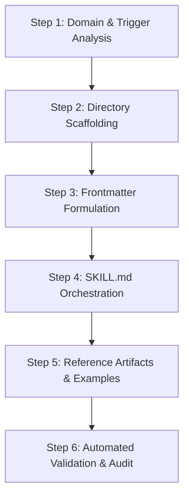

# Creating Antigravity Skills (Master Skill)

## When to use this skill
- Creating a new skill directory under `.agent/skills/<skill-name>/` or `.agents/skills/<skill-name>/`.
- Refactoring, modularizing, or optimizing existing skills for token efficiency and semantic precision.
- Auditing skills for trigger precision, broken relative links, placeholder code, or invalid YAML frontmatter.
- Formulating specialized domain knowledge packages (runbooks, checklists, and runnable scripts).

---

## 1. Antigravity Skill Architecture & Directory Standards

Every skill MUST be an isolated directory inside a customization root (`.agent/skills/` or `.agents/skills/`). Never place raw `.md` files directly in `skills/`, as Antigravity will not discover or index them.

```text
.agent/skills/<skill-name>/
├── SKILL.md                  # [Required] Master runbook with YAML frontmatter (<400 lines)
├── scripts/                  # [Optional] Runnable helper scripts (Node.js, Python, PHP, Shell)
├── examples/                 # [Optional] Concrete reference implementations isolated by tech stack
├── resources/                # [Optional] Reusable checklists, audit matrices, schemas, templates
└── references/               # [Optional] Deep architectural guides, manuals, and extended specs
```

### Directory Roles & Boundary Rules:
- **`SKILL.md`**: The primary entry point. Kept lean and operational. Outlines high-level workflow, decision matrices, and links to secondary files.
- **`examples/`**: Real, working, enterprise-grade code files. Must NEVER contain placeholder comments (`// TODO`, `...rest of code`).
- **`resources/`**: Operational checklists and domain cheat-sheets that can be referenced during task execution.
- **`references/`**: Heavy documentation or detailed API specs loaded on demand via progressive disclosure.
- **`scripts/`**: Executable utilities. Must provide clear help flags (`--help`) and adhere to explicit process termination (`process.exit(0)` / `process.exit(1)`).

---

## 2. YAML Frontmatter Standards (The Semantic Router)

The YAML frontmatter of `SKILL.md` is the **single most critical factor** for skill invocation. Before activating a skill, the agent only sees the `name` and `description` in its system context.

```yaml
---
name: managing-postgres-mysql
description: >-
  Provides expert DBA workflows, query tuning, indexing strategies, diagnostic queries,
  and zero-downtime migration guidelines for PostgreSQL and MySQL. Use when the user asks
  for database administration, SQL optimization, EXPLAIN ANALYZE, deadlock debugging,
  vacuuming, connection pooling, or safe schema migrations.
---
```

### Strict Frontmatter Directives:
1. **`name`**:
   - Must use lowercase alphanumeric characters and hyphens only (`^[a-z0-9]+(-[a-z0-9]+)*$`).
   - Must be in **gerund form** (`developing-...`, `auditing-...`, `managing-...`, `configuring-...`, `assuring-...`).
   - Maximum 64 characters.
   - Do NOT include generic branding terms (`claude`, `anthropic`, `gemini`).
2. **`description`**:
   - Must be written in the **third person** ("Provides expert...", "Audits web applications...", "Assists with...").
   - Maximum 1024 characters.
   - Must follow the **Trigger Formula**:
     - `[Scope & Expertise]` + `[Key Capabilities]` + `Use when [Concrete User Intents, Actions, File Extensions, Tool Names]`.
   - See detailed trigger patterns in [resources/frontmatter-trigger-guide.md](./resources/frontmatter-trigger-guide.md).

---

## 3. Progressive Disclosure & Token Economy

Antigravity operates with progressive disclosure to protect context window tokens:
- **System context**: Only `name` and `description` are initially visible to the model.
- **Step 1 activation**: The agent reads `SKILL.md` upon deciding the skill is relevant.
- **Step 2 deep dive**: Secondary files (`references/`, `examples/`, `resources/`) are loaded **only when needed**.

### Rules for Progressive Disclosure:
- **Strict Line Budget**: Keep `SKILL.md` under 400 lines (hard limit: 500 lines).
- **One Level of Indirection**: Relative links in `SKILL.md` should link directly to targeted secondary files (e.g., `[Checklist](./resources/skill-quality-checklist.md)`), not nested chains of redirects.
- **Paths**: Always use forward slashes (`/`), never backslashes (`\`), for cross-platform compatibility.

---

## 4. The Degrees of Freedom Model

Match instruction style to the fragility and determinism of the task:

| Freedom Level | When to Use | Documentation Style | Example |
| :--- | :--- | :--- | :--- |
| **High Freedom** | Creative decisions, architecture planning, heuristics | Principles, bullet points, decision trade-offs | "Choose between SSR and SPA based on crawler requirements" |
| **Medium Freedom** | Structural patterns, boilerplate, design contracts | Interface definitions, code templates, schemas | TypeScript interfaces, DTO definitions, component skeletons |
| **Low Freedom** | Fragile operations, security validations, migrations | Explicit deterministic commands, rigid scripts | Zero-downtime DDL commands, crypto hashing flags, CLI commands |

---

## 5. Workspace Integration & Rule 8 Alignment

In modern agent workflows, agents must extract stack-matched resources rather than scanning all files indiscriminately. Design your skills to support **Mandatory Stack-Matching Extraction**:

1. **Stack-Isolated File Naming in `examples/`**:
   - Use clear stack prefixes: `laravel-controller-eloquent.php`, `symfony-controller-doctrine.php`, `vue-store-pinia.ts`.
   - Allows the executing agent to load solely the stack matching the active project.
2. **Domain-Specific Checklists in `resources/`**:
   - Split large checklists into standalone domain files: `owasp-audit-checklist.md`, `container-disk-bloat-prevention.md`.
3. **Automated Verification Helpers in `scripts/`**:
   - Provide linting or validation scripts that the executing agent can run to verify work automatically.

---

## 6. End-to-End Skill Creation Workflow

Follow this systematic lifecycle whenever generating or refactoring a skill:



### Step 1: Domain & Trigger Analysis
- Define the exact technical scope, target frameworks, and boundary conditions.
- Identify the user queries that should trigger this skill.

### Step 2: Directory Scaffolding
Create the directory structure under `.agent/skills/<skill-name>/` using `write_to_file`.

### Step 3: Frontmatter Formulation
Draft the YAML frontmatter adhering to the trigger formula. Validate that the gerund name is clean and descriptive.

### Step 4: SKILL.md Orchestration
Write the master instructions:
- "When to use this skill" bullet list.
- Operational steps / execution phases.
- Degrees of freedom applied to critical tasks.
- Explicit cross-links to `./examples/`, `./resources/`, and `./scripts/`.

### Step 5: Implement Concrete Reference Artifacts
- Add realistic, enterprise-grade code in `examples/` (no placeholders, strict typing, complete error handling).
- Add actionable audit checklists in `resources/`.
- If automating multi-step shell checks, add a standalone script in `scripts/`.

### Step 6: Automated Validation & Quality Audit
Run the skills validation script:
```bash
node .agent/skills/creating-agent-skills/scripts/validate-skills.mjs
```
Audit against [resources/skill-quality-checklist.md](./resources/skill-quality-checklist.md).

---

## 7. Anti-Patterns to Strictly Avoid

1. ❌ **Loose `.md` files in root**: Storing `my-skill.md` directly in `.agent/skills/` (prevents runtime discovery).
2. ❌ **Vague triggers**: Writing descriptions like "Helps with coding and best practices" (causes excessive false-positive activations).
3. ❌ **Generic AI fluff**: Explaining basic language concepts (e.g., explaining what an HTTP GET request or a Docker image is).
4. ❌ **Placeholder examples**: Using `// TODO: implement logic` or `/* rest of file */` in `examples/`.
5. ❌ **Monolithic `SKILL.md`**: Dumping thousands of lines into `SKILL.md` instead of utilizing `references/` or `examples/`.
6. ❌ **Broken markdown links**: Using dead links or Windows backslashes in markdown file links.
