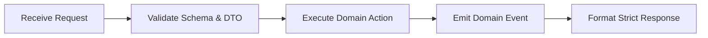

# Sample Domain Management (Template Example)

## When to use this skill
- Implementing domain services under `app/Domain/Sample/`.
- Validating input payloads against enterprise DTO contracts.
- Executing domain migration scripts or automated reconciliation jobs.

---

## 1. Architectural Principles
- **Thin Transport**: Keep HTTP controllers and queue handlers under 30 lines.
- **Domain Encapsulation**: Pure business rules reside inside domain action classes.
- **Strict Contracts**: All data transfer across boundaries requires typed DTOs.

---

## 2. Core Execution Workflow



### Execution Steps:
1. **Validate Input**: Ensure all required attributes match the schema specification.
2. **Execute Action**: Invoke the isolated domain service within an atomic transaction.
3. **Verify State**: Assert data integrity invariants before committing.

---

## 3. High / Medium / Low Freedom Guidelines

- **High Freedom (Heuristics)**:
  - Select caching strategy (Redis vs in-memory) based on eviction frequency and payload size.
- **Medium Freedom (Code Structure)**:
  - All domain actions must implement a single public `execute(DomainDTO $dto): DomainResult` method.
- **Low Freedom (Deterministic Commands)**:
  - Always execute migrations with the dry-run flag first:
    ```bash
    sample-cli migrate --dry-run
    ```

---

## 4. Supporting Resources
- [Domain Checklist](./resources/sample-domain-checklist.md)
- [DTO Reference Implementation](./examples/sample-dto-contract.ts)
