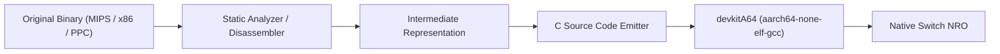

# Switch Game Porting & Reverse Engineering Guide

This guide provides deep technical architectures, reverse engineering workflows, and porting strategies for translating PC and retro console games to native Nintendo Switch homebrew using `libnx`, `SDL2`, and `devkitA64`.

---

## 1. Ghidra Decompilation & Binary Translation (x86/Win32 $\rightarrow$ ARM64 C)

When source code is unavailable, Ghidra decompilation coupled with manual shimming is the standard approach for 1995–2010 PC titles (C/C++, DirectX 5–9, GDI/DirectDraw).

### Auto-Analysis Configuration in Ghidra
1. **Load Binary**: Import the 32-bit PE (`.exe`). Set architecture to `x86:LE:32:default:windows`.
2. **Analysis Options**:
   - Enable `Decompiler Parameter ID`.
   - Enable `Windows x86 PE RTTI Analyzer` (crucial for recovering C++ class vtables).
   - Enable `Demangler Microsoft` to resolve decorated symbol names (`?MyFunc@@YAHH@Z`).
3. **Pointers & Calling Conventions**:
   - Win32 x86 typically uses `__stdcall` (`WINAPI`) for API callbacks and `__thiscall` (register `ECX` holds `this` pointer) for C++ methods.
   - When exporting to C for AArch64 compilation, strip calling convention specifiers (`__cdecl`, `__stdcall`, `__thiscall`) using regex, as AArch64 uses the standard ARM64 AAPCS calling convention (arguments in `X0-X7`).

### 32-bit to 64-bit Pointer Width Gotchas
- **Pointer Truncation**: Many 32-bit Windows games cast pointers to `DWORD` or `LONG` (`(DWORD)pObject`). On AArch64, pointers are 64-bit (`uintptr_t` / `uint64_t`). Storing a pointer in a 32-bit integer causes instant segmentation faults (`2168-0002`).
- **Structure Padding**: 64-bit alignment changes `sizeof()` structures. If reading binary save files or asset packs directly into C structs via `fread(&struct, sizeof(struct), 1, fp)`, always enforce `#pragma pack(push, 1)` or explicitly serialize fields individually.

---

## 2. Engine-Specific Porting Pipelines

### A. Unity (.NET / Mono & IL2CPP)
1. **Mono Pipeline (`Assembly-CSharp.dll`)**:
   - Decompile `*_Data/Managed/Assembly-CSharp.dll` with **dnSpy** or **ILSpy**.
   - Export logic to a clean C# project.
   - Inspect platform-dependent code:
     - Input: Replace `Input.GetKey(KeyCode.Space)` with Rewired, Unity Input System, or Nintendo SDK gamepad mappings.
     - Filesystem: Replace `Application.dataPath` or `System.IO.File` with persistent Switch save directories (`Application.persistentDataPath` maps to Switch user save data).
   - Port scripts into a clean Switch Unity Project configured with Nintendo Switch Build Support or compile via standalone Mono runtime.
2. **IL2CPP Pipeline (`GameAssembly.dll` / `libil2cpp.so`)**:
   - Extract method metadata and headers using **Il2CppDumper**:
     ```bash
     Il2CppDumper.exe GameAssembly.dll global-metadata.dat out/
     ```
   - Inspect `dump.cs` to understand all game classes, method offsets, and field structures.
   - Load `script.py` in Ghidra or IDA Pro to label all stripped functions with their original C# names.

### B. GameMaker Studio (`data.win`)
1. **Extraction**: Open `data.win` in **UndertaleModTool**.
2. **Bytecode Version Verification**: GameMaker bytecode (e.g., GM:S 1.4, GMS 2.x) determines the runner compatibility.
3. **Switch Deployment**:
   - Extract all GML scripts, room data, textures, and audiogroups.
   - Inject the bytecode package into an existing official Nintendo Switch GameMaker runner `.nro`.
   - Update `options.ini` and verify that audio formats match (convert WAV to OGG if required by the runner).

### C. Godot Engine (`*.pck`)
1. **Decompilation**: Use **GDRE Tools** (Godot Reverse Engineering Tools) to recover `.gd` scripts, scenes (`.tscn`), and project settings (`project.godot`).
2. **Re-Exporting**: Import recovered project into matching Godot version and compile with the community Godot Switch homebrew exporter or native libnx port.

---

## 3. Static Binary Recompilation (Static Recomp)

Static recompilation transforms binary machine code into native C source code at compile time without JIT overhead.



### Key Tools & Workflows:
- **N64Recomp / Zelda64Recomp**: Recompiles N64 MIPS binaries into portable C. Generates high-framerate, widescreen ports running at native 60fps on Switch.
- **xboxrecomp**: Statically decompiles Original Xbox (x86) binaries to C, translating Direct3D 8 fixed-function pipelines into modern shaders.
- **rev.ng**: Enterprise-grade binary analysis framework translating x86 machine code to LLVM IR, which compiles directly for AArch64.

---

## 4. Subsystem Replacement: Win32 $\rightarrow$ SDL2 / libnx

| Win32 Subsystem | PC Implementation | Switch Replacement |
| :--- | :--- | :--- |
| **Window Creation** | `CreateWindowExA(...)` | `SDL_CreateWindow("Game", SDL_WINDOWPOS_CENTERED, SDL_WINDOWPOS_CENTERED, 1280, 720, SDL_WINDOW_SHOWN)` |
| **DirectDraw / Surface** | `IDirectDrawSurface::Lock(...)` | `SDL_CreateTexture(..., SDL_TEXTUREACCESS_STREAMING, ...)` + `SDL_UpdateTexture(...)` |
| **Graphics Hardware** | Direct3D 9 (`IDirect3DDevice9`) | `SDL_Renderer` (accelerated) or `deko3d` (low-level native NVN wrapper) |
| **Message Loop** | `GetMessage(&msg, NULL, 0, 0)` | `while (SDL_PollEvent(&event)) { ... }` or `PeekMessageA(&msg, ...)` |
| **Gamepad / Keys** | `GetAsyncKeyState(VK_SPACE)` | Joy-Con buttons (`A/B/X/Y`, D-Pad, sticks) or `SDL_GetKeyboardState` |
| **Mouse / Touch** | `GetCursorPos` / `SetCursorPos` | Capacitive touch screen (`hidGetTouchScreenStates`) + `SDL_GetMouseState` |
| **Audio** | DirectSound / `waveOutWrite` | `SDL_OpenAudioDevice` / `sndPlaySoundA` / `libnx` `audren` |
| **Virtual Memory** | `VirtualAlloc` / `VirtualFree` | Safe zero-initialized Horizon OS heap via `calloc()` / `free()` |
| **Thread Synchronization**| `CRITICAL_SECTION` | Recursive `SDL_CreateMutex` + `__atomic_*` atomics |
| **Configuration / INI** | `GetPrivateProfileStringA(...)` | Dual-lookup: default `romfs:/` read with user `sdmc:/` write/fallback |
| **Registry Stubs** | `RegOpenKeyExA(...)` | Safe fallback stubs returning `ERROR_SUCCESS` / flat JSON/INI configs |
| **Timers** | `timeGetTime()` / `GetTickCount()` | `SDL_GetTicks()` or `armTicksToNs(armGetSystemTick())` |
| **Filesystem** | `C:\Game\data\level.pak` | `romfs:/data/level.pak` (read-only) or `sdmc:/switch/game/` |

---

## 5. Horizon OS Architecture & Crash Diagnosis

### Title Takeover vs Applet Mode
- **Applet Mode (Album Launcher)**:
  - Memory ceiling: **~400 MB**.
  - Background audio suspended on overlay.
  - Insufficient for 95% of ported games.
- **Title Takeover (Hold R while launching any official installed game)**:
  - Memory ceiling: **~3280 MB** physical RAM available.
  - Full GPU clock profile allowed (up to 768 MHz in handheld, 921 MHz in docked).

### Horizon OS Panic Error Codes:
- `2168-0002`: Fatal crash due to segmentation fault, invalid memory read/write, or unaligned memory access.
  - *Cause*: Uninitialized pointers, 32-bit pointer truncation, or static BSS overflow.
- `2162-0002`: Abort signal raised.
  - *Cause*: Standard library `abort()`, unhandled `std::terminate()`, or failed `NX_ASSERT()`.
- `2002-3005`: Filesystem error (RomFS mount failed).
  - *Cause*: Missing `romfs.bin` during packaging or failing to call `romfsInit()`.

### BSS Allocation Rule:
Never declare huge static buffers in global scope:
```c
/* ❌ DANGEROUS: Will crash nx-hbloader on launch */
static uint8_t g_game_buffer[64 * 1024 * 1024];

/* ✔ CORRECT: Dynamically allocate from the heap during initialization */
static uint8_t* g_game_buffer = NULL;
g_game_buffer = (uint8_t*)malloc(64 * 1024 * 1024);
```

---

## 6. x86 Assembly, SIMD Intrinsics & Threading Shims

### A. Inline x86 Assembly (`__asm`)
MSVC 32-bit x86 code frequently contains inline assembly blocks for bit manipulation, fast copying, or CPU timestamping:
- **`rdtsc`**: Replace `__asm { rdtsc }` with `armGetSystemTick()` or `SDL_GetPerformanceCounter()`.
- **`cpuid`**: Hardcode CPU features (Switch is Cortex-A57: ARMv8-A with FP, NEON, CRC32, Crypto extensions).
- **Fast memcpy/memset (`rep movsd`)**: Replace with standard C `memcpy()` / `memset()`, which are heavily optimized in devkitA64's newlib libc.

### B. SIMD Vectorization (x86 SSE/SSE2 $\rightarrow$ ARM NEON)
If decompiled math code utilizes Intel SSE intrinsics:
- Include `<arm_neon.h>` on AArch64.
- Or use the open-source header `sse2neon.h` as a drop-in translator converting `__m128` SSE operations (`_mm_add_ps`, `_mm_mul_ps`) into native ARM NEON vectors (`vaddq_f32`, `vmulq_f32`) with zero runtime overhead.

### C. Multithreading (`CreateThread` $\rightarrow$ `SDL_CreateThread` / `libnx`)
- Win32 `CreateThread` does not configure the thread priority or core affinity required by Horizon OS.
- Replace with `SDL_CreateThread()` or native `threadCreate()` / `threadStart()` from `libnx`.
- Pin worker threads to CPU Cores 0, 1, or 2 (Core 3 is reserved for Horizon OS kernel and audio drivers).

---

## 7. Tegra X1 Hardware Clocks, 8-bit Palettes & Video Pipelines

### A. Tegra X1 CPU Boost Mode (Fast Loading Transitions)
The Nintendo Switch Tegra X1 default CPU clock is **1020 MHz**. For games with heavy initial asset unpacking or level loading, developers can temporarily activate **Boost Mode (1785 MHz)** via `appletSetCpuBoostMode(ApmCpuBoostMode_Type1)` and revert to standard clocks once loading completes with `Switch_SetCpuBoost(false)`.

### B. 8-bit Indexed Palette Emulation (256 Colors)
Classic PC games (Fallout, Diablo, Command & Conquer, Heroes of Might & Magic) render to an 8-bit index framebuffer with a 256-color palette. Modern HDMI display requires 32-bit ARGB8888. Use `Switch_BlitPalette8ToARGB32()` from `win32_to_sdl2_shim.h` to convert 8-bit indexed buffers to 32-bit streaming textures in real time.

### C. Bink Video (`.bik`) & Smacker (`.smk`) Transcoding
Pre-rendered FMV cutscenes using Bink Video (`binkw32.dll`) or Smacker (`smackw32.dll`) cannot execute their proprietary x86 binary codecs on ARM64:
1. Transcode `.bik` files using `ffmpeg`:
   ```bash
   ffmpeg -i intro.bik -c:v libvpx-vp9 -b:v 1500k -c:a libopus -b:a 128k intro.webm
   ```
2. Play back using an open-source WebM / VP9 decoder or skip FMV calls by replacing `BinkOpen()` with immediate playback completion.
